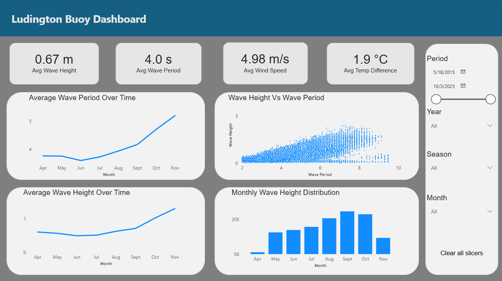
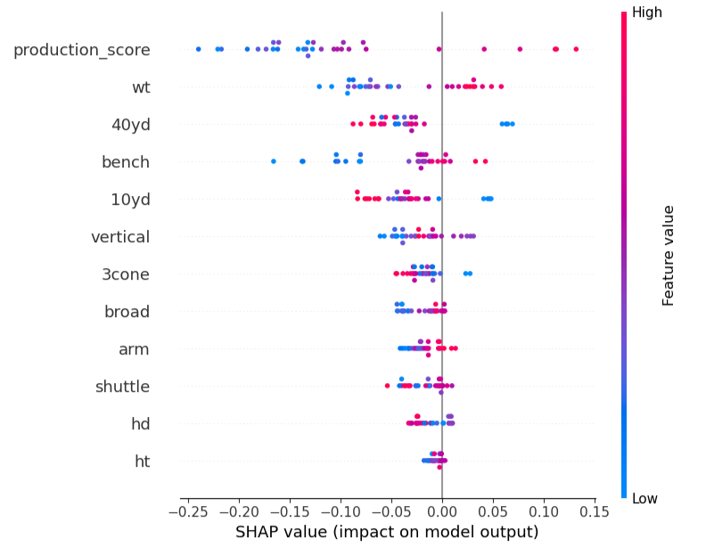
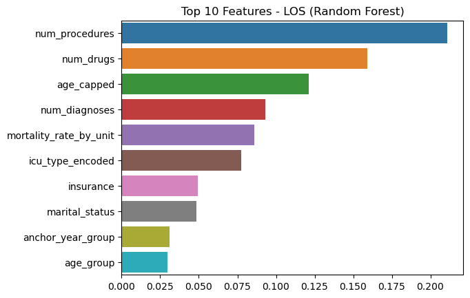
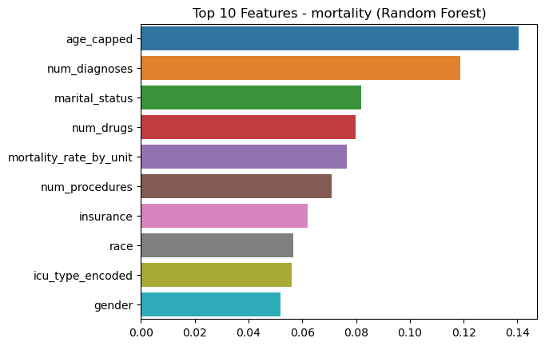
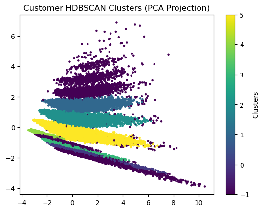
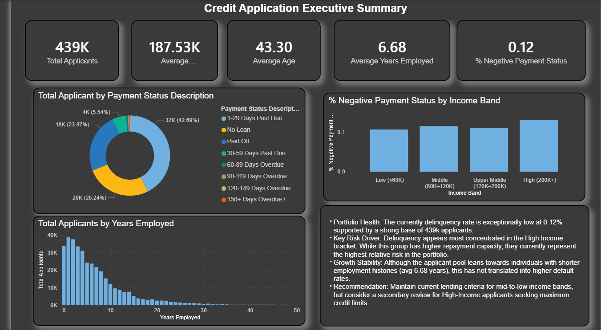

# Taylen-Inthisane-Portfolio
Data science portfolio

# [Project 1: Predicting Future Wave Conditions: Project Overiew](https://github.com/Initial-T53/Michigan-Waves).
* Analyzed 200,000+ NOAA buoy observations to identify patterns and forecast future wave height and dominant wave period conditions.
* Cleand and transformed environmental data using Python, including missing value imputation, feature engineering, and time-based lag variables.
* Built and evaluated multiple regression models using chronological validation to compare predictive performance.
* Developed an interactive Power BI dashboard to visualize wave trends, seasonal patterns, and historical conditions for data-driven decision making.

# [Project 2: NFL Interior Defensive Linemen Classification:](https://github.com/Initial-T53/NFL-IDL-Measurables/).
* Built a classification model using 2019-2025 NFL IDL combine production data to identify traits most associated with becoming an NFL Plus Starter (top 25% PFF Grade).
* Conducted SHAP feature importance analysis, finding that college production score was the strongest predictor, followed by weight, speed metrics (40-yard dash, 10-yard split) and upper-body strength.
* Trained and tuned a RandomForest Classifier to learn historical patterns and applied the model to the 2026 IDL draft class.
* Model projected Zane Durant (Penn State) and Chris McClellan (Missouri) as future Plus Starters, balancing both athleticism and production profiles.

# [Project 3: Diabetes Risk Prediction & Early Detection: Project Overview](https://github.com/Initial-T53/Diabetes-Risk-Project)
* Built a machine Learning model to predict diabetes diagnosis using demographic, lifestyle and metabolic indicators.
* Tested Logistic Regression, Random Forest and XGBoost ; selected Random Forest for lowest false positives.
* Used SHAP values to interpret predictions: HbA1c, fasting glucose and postprandial glucose were top predictors.
* Created a risk stratification tool with low/medium/high threasholds to guide preventive care.

# [Project 4: ICU Patient Outcome Analysis : Project Overview](https://github.com/Initial-T53/ICU-Patient-Analysis)
* Analyzed and worked with ICU electronic medical records to identify predictors of mortality and legnth of stay.
* Used Ordinary least squares, lasso regression, ridge regression and random forest model. GridsearchCV was used to hypertune lasso and ridge regression
* Identified features that are strong associated with patients length of stay and mortality risk
* Recommended risk-wristbands and medication recommender system.

# [Project 5: Amazon Sales Data Clustering : Project Overview](https://github.com/Initial-T53/Amazon-Sales-Data)
* Performed customer-level feature engineering on a synthetic Amazon sales dataset, correcting inconsistent purchase amounts, product categories, and tax to enable reliable behavior analysis.
* Built two clustering pipelines: behavioral segmentation using KMeans and HDBSCAN, and attempted seasonality-aware segmentation using monthly purchasing vectors.
* Identified distinct customer personas based on spending patterns, order frequency, discount sensistivitym and basket behavior, including handling of HDBSCAN's noise cluster for unclusted customers.
* Delivered marketing-focused recommendations for each segment, highlighting opportunities for targeted promotions, churn-risk, identification, loyalty improvements and personalized customers experiences.

# [Project 6: Credit Application Dashboard: Project Overview](https://github.com/Initial-T53/Credit-Analysis)
* Built a multi-page analytical dashboard covering Executive Summary, Demographics, Credit History, and Deep Dive to support lending decisions.
* Analyzed Demographics and Socioeconomic factors influencing credit outcomes, including income bands, employment stability, family structure, and housing type.
* Identified high-risk and low-risk applicant segments using behavioral patterns, stability indicators, and credit history trajectories.
* Delivered decision-support insights for lending teams, highlighting risk concentrations, applicant stability, and factors most predictive of default or late payment.

* [Interactive Dashboard](https://app.powerbi.com/view?r=eyJrIjoiNTljNmY4ODUtM2IyZi00ZTA4LWJhNTctZmUzMjBmODBiNDAxIiwidCI6IjllZjlmNDg5LWUwYTAtNGVlYi04N2NjLTNhNTI2MTEyZmQwZCIsImMiOjF9)

